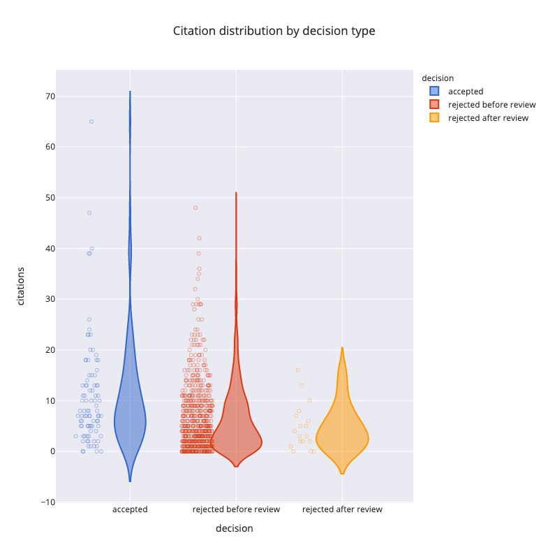

# Intro

MatchPub2 scans the literature to retrieve papers that were handled by a journal and analyzes their fate (where they were published) and citation distribution as a function of the editorial decision made by the journal (accept, reject before review, reject after review).

As input, MatchPub2 ingests the data produced with the eJP SQL query `queries/matchpub.sql` in `.xls` format.

An alternative input is the ejp `editor_track_report.xls` report (using the detailed format). In this case, the decisions labels used in this report need to be mappted to the three fundamental decisions -- accept, rejected before review, rejected after review -- by updating accordingly the regular expressions provided in `decision.py`. The naming and the order of the columns of the `editor_track_report.xls` can be customized in `descriptions.ejp_editor_track_report` as described in the modules' documentation.

By default, content of published papers is retrieved from [EuropePMC](http://europepmc.org/) (but see below on how to use PubMed instead).

Citations data are obtained from [Scopus](https://www.elsevier.com/solutions/scopus).

## To install the application:

Clone this repository.

Update `.env.example` with your user id (`id -u`) and group id (`id -g`), your Scopus API_Key (register at https://dev.elsevier.com/).

Install `docker` and `docker-compose` (https://www.docker.com/get-started).

Build the application:

    docker-compose build

Download the eJP report into the `data/` directory (or `/data` from within the container since `data/` is 'bind mounted' (https://docs.docker.com/storage/bind-mounts/) to the container's `/data` volume).

## Run a scan

Run a scan from the command line within the docker container:

    docker-compose run --rm matchpub bash
    python -m src.scan /data/to/ejp_report.xls> /results/to/result/> # use --no_citations to prevent inclusion of citation data.

The default search engine is EuropePMC. To use PubMed instead, use the flag `--use_pubmed`. In our experience, PubMed is slower and does not lead to higher recall rates.

To obtain debug-level information run the scan with `-D` option.

To prevent inclusion of Scopus citation data, use the `--no_citations` flag.

In addition to the specified `<result>.xlsx` file, MatchPub will save a `<result>-not-found.xlsx> file` with the list of papers that could not be matched. Graphical reports will be saved in `/reports`.

To run the interactive visualization in a Jupyter notebook:

    docker-compose up
    # use link provided as output: http://127.0.0.1:8888/?token=<...> to access the notebook in the browser

Shut down with Ctrl-C

## Settings

Some settings can be changed in `src/config.py`. 

To scan only preprints, set `preprint_inclusion` to `PreprintInclusion.ONLY_PREPRINT`.

To avoid the inclusion of citation data, set `include_citations` to `False` or invoke `src.scan` with the `--no_citations` option.

A customizable description of the format of the input file can be specified with `input_description_file`.

Descriptions of input files and their documentation are provided in `src/description.py`.

## Reports

### Analysis overview

This reports provides an overview of the 'quality' of the scan. It main purpose is visualize the fraction of papers that could be retrieved.

### Manuscript fate

This reports shows the journals in which rejected papers were ultimately published. The size of the sectors is proportional to the number of papers.

### Citation distribution (violin plots)

This reports plots Scopus citation data for papers accepted, rejected before review and rejected after review. With the interactive HTML version of this report, hovering over a point displays information on the journal, doi, title and manuscript number of the paper.

## Citation distribution (histogram)

This report displays citation data for papers accepted, rejected before review and rejected after review. The data is split into 150 citation bins and displayed as a histogram distribution.

## The Grand Cru experiment

This is a less serious report...

The papers of the  journal (the "Grand Cru") are merged with an "Assemblage" of rejected papers that were ultimately published in the external journals to obtain a 'synthetic journal' named "Cuvee". The N (default `n_top=3`) largest destination external journals shown in the 'manuscript fate' report are used.

The impact of this 'merger' is visualized by comparing the disribution of the 'Grand Cru', 'Cuvee' and 'Assemblage'.

